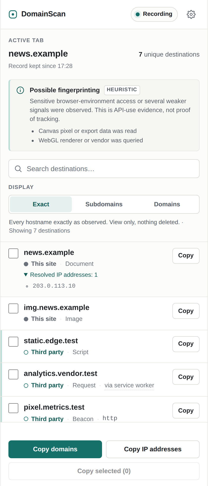
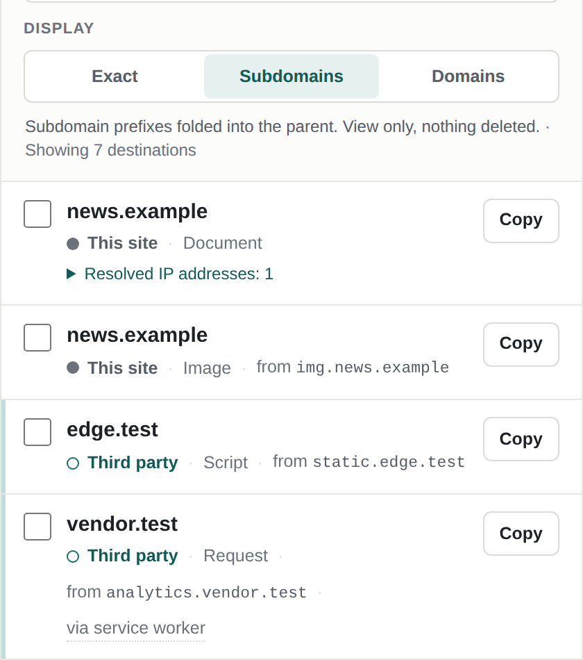
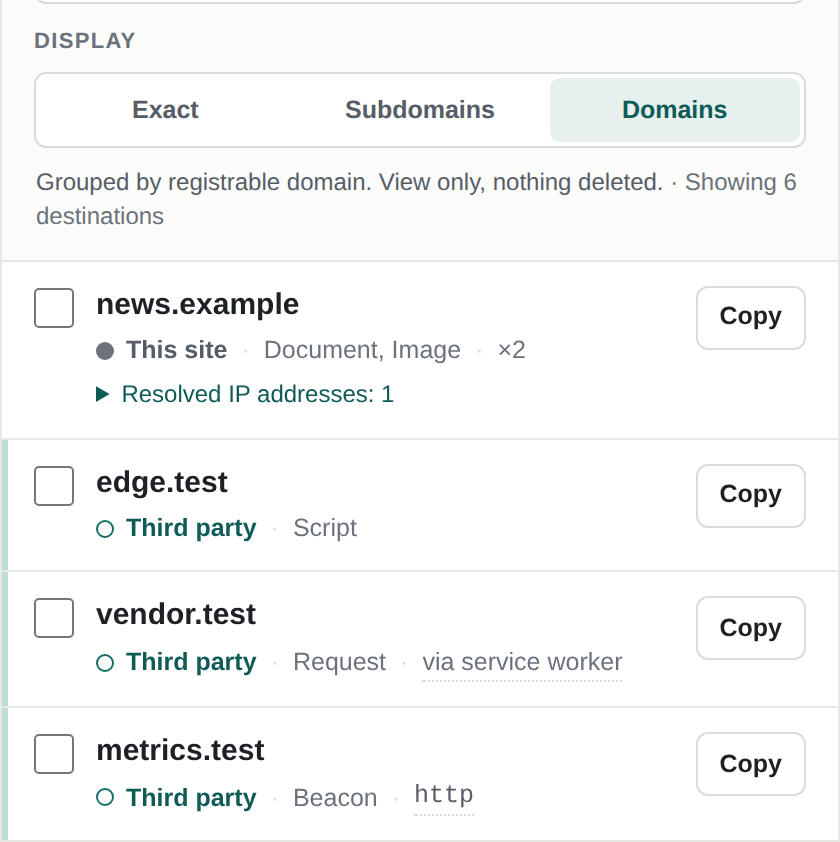
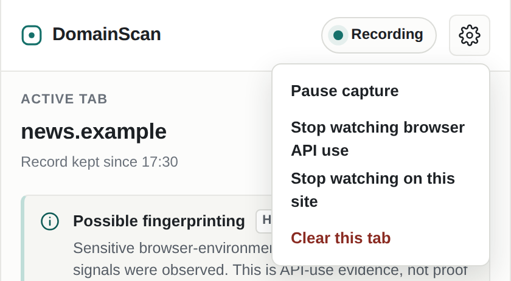

<p align="right"><a href="README.md">English</a> · <b>Русский</b></p>

# DomainScan

Боковая панель Chrome, которая записывает все сетевые назначения активной вкладки - узлы, полученные
IP-адреса, рукопожатия WebSocket - и хранит эту запись точной, читаемой и готовой к копированию.

[](https://github.com/mazixs/DomainScan/actions/workflows/ci.yml)
[](https://github.com/mazixs/DomainScan/releases/latest)
[](https://developer.chrome.com/docs/extensions/reference/api/sidePanel)
[](LICENSE)

<p align="center">
  
</p>

> [!NOTE]
> Это перевод. Источник истины - [README.md](README.md) на английском.

Расширение сделано для тех, кто хочет видеть, куда страница отправляет запросы, и не получать вместо
этого пугающую цифру. Сначала точные улики, толкование всегда помечено как толкование, и ничего не
покидает браузер: расширение не делает собственных сетевых запросов и не собирает значения, которые
читает страница.

## Что записывается

- **Все назначения активной вкладки** - узел или прямой IP, свой или сторонний, тип запроса и сколько
  раз он был замечен.
- **Все полученные IP-адреса узла**, а не только последний, с временем первого и последнего обращения.
- **Каким способом произошло обращение** - незашифрованные `http` и `ws` названы прямо в строке, как и
  запрос, сделанный service worker сайта, а не самой страницей.
- **Обращения к API страницы** - чтение Canvas, запрос рендерера WebGL, аудио, часовой пояс, языки,
  геолокация и подробные подсказки User-Agent. Записывается только сам факт вызова, никогда значение,
  а сводка всегда помечена как эвристика.
- **Одна запись на вкладку и на сайт.** Пути и поддомены продолжают накапливаться, переход на другой
  регистрируемый домен начинает запись заново и не трогает соседние вкладки.

## Установка

> [!NOTE]
> В Chrome Web Store расширения пока нет, поэтому оно ставится распакованным.

1. Скачайте `domainscan-vX.Y.Z.zip` со страницы
   [релизов](https://github.com/mazixs/DomainScan/releases/latest) и распакуйте, либо клонируйте
   репозиторий.
2. Откройте `chrome://extensions` и включите **режим разработчика**.
3. Нажмите **Загрузить распакованное расширение** и выберите распакованную папку.
4. Щелкните значок DomainScan на панели инструментов, чтобы открыть боковую панель.

Нужен Chrome 114 или новее.

## Как пользоваться

Список наполняется по мере просмотра и не перестраивается под руками: раскрытый список IP-адресов,
фокус клавиатуры и положение прокрутки переживают каждый входящий запрос.

Три режима отображения меняют вид и ничего не удаляют:

| Поддомены свернуты к родителю | Сгруппировано по домену |
| --- | --- |
|  |  |

Копирование разделено и говорит, что именно копирует: все видимые домены, все видимые IP-адреса или
отмеченные строки.



Запись ставится на паузу для каждой вкладки отдельно, а наблюдение за обращениями к API страницы
выключается для одного сайта или целиком: инструментирование незаметно для обычных проверок, но ни
одно инструментирование не бывает незаметным для любой защиты от ботов, поэтому сайт, который на это
реагирует, можно просто исключить. На запись сети выключатель не влияет.

## Приватность и разрешения

DomainScan не обращается ни к GeoIP, ни к аналитике, ни к телеметрии. Он наблюдает события браузера
локально и не собирает значения, которые возвращают API часового пояса, языка, геолокации, Canvas,
WebGL, аудио и подсказок User-Agent. В production-коде нет ни одной зависимости.

| Разрешение | Зачем оно нужно |
| --- | --- |
| `webRequest` | Наблюдение за метаданными запросов и ответов без блокировки и изменения трафика. |
| `storage` | Сохранение записи вкладки при усыплении service worker. |
| `sidePanel` | Сама боковая панель. |
| `scripting` | Регистрация наблюдателя страницы во время работы - именно это позволяет выключать его по сайту. |
| Доступ к `<all_urls>` | Наблюдение назначений на произвольных сайтах и инструментирование их страниц. |

Разрешение `tabs` намеренно **не** запрашивается: идентификаторы вкладок, события активации и
подтвержденный URL вкладки, по которому определяется текущий сайт, доступны по host permissions.

## Ограничения, о которых стоит знать

- IP-адрес доступен только тогда, когда его сообщает Chrome; для ответов из кеша его может не быть.
- У WebSocket видно открывающее рукопожатие, но никогда не содержимое сообщений.
- Сигнал обращения к API доказывает, что вызов был. Он не доказывает намерение, успех или что
  значение пригодилось - поэтому панель говорит "возможный" и никогда не выставляет оценку сайту.
- Запросы service worker записываются, пока его origin открыт хотя бы в одной вкладке; то, что worker
  делает без открытой вкладки, и то, к чему обращается предзагруженная страница до того, как вы ее
  откроете, не записывается, а не приписывается чужому сайту.
- Записи живут в сессионном хранилище: закрытие вкладки удаляет ее запись, закрытие браузера - все.

## Разработка

Поддерживаемая среда - Node.js 22.

```bash
npm ci
npm run verify                      # синтаксис, манифест и парность локалей, сгенерированный PSL, тесты
npx playwright install chromium
npm run test:e2e                    # загружает распакованное расширение в Chromium
```

Панель можно открыть вне Chrome для работы над оформлением: раздайте репозиторий командой
`python3 -m http.server 8080` и откройте `/src/sidepanel/panel.html` - панель заметит отсутствие
`chrome` API и запустится на демонстрационных данных, все элементы управления при этом работают.

## Документация

- [docs/ARCHITECTURE.md](docs/ARCHITECTURE.md) - рантайм-контракт: модель состояния, правила
  привязки, сообщения, хранение.
- [PRODUCT.md](PRODUCT.md) - аудитория, назначение и принципы, которым подчинен интерфейс.
- [output/technical-audit.md](output/technical-audit.md) - текущий аудит и платформенные ограничения,
  стоящие за решениями.
- [THIRD_PARTY_NOTICES.md](THIRD_PARTY_NOTICES.md) - вложенный Public Suffix List и его лицензия.

## Лицензия

[MIT](LICENSE)
